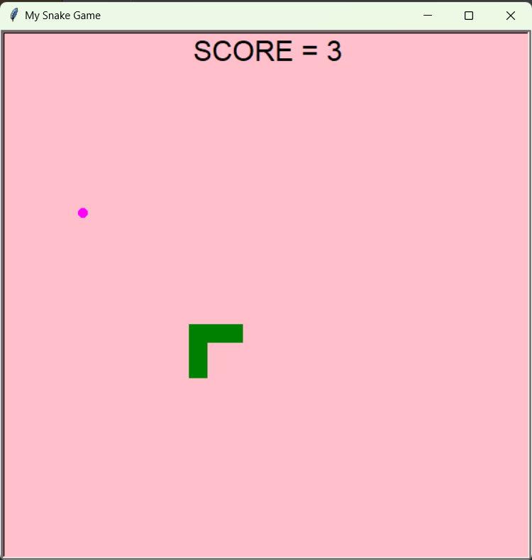
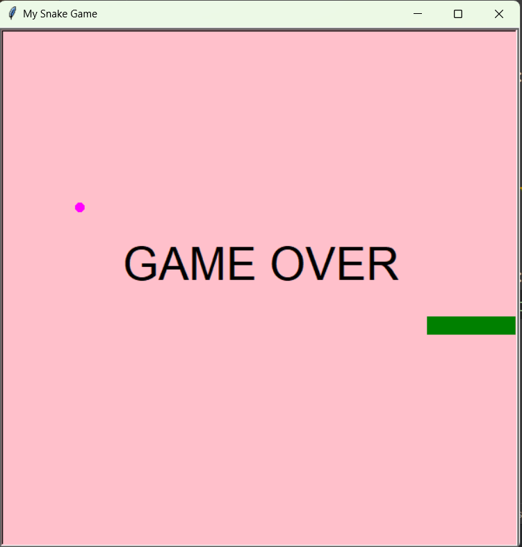

# Python-Snake-Game

A classic **Snake Game** implemented in Python using the Turtle graphics module.  
The project demonstrates **object-oriented programming (OOP)** principles, modular design, collision detection, responsive controls, and score tracking.

---

## Screenshots

  

---

## Features
- Built with **OOP** (classes for Snake, Food, and Scoreboard).  
- Modular and easy-to-read code structure.  
- Collision detection with walls, food, and the snake’s body.  
- Dynamic score tracking.  
- Simple, responsive keyboard controls (arrow keys).

---
